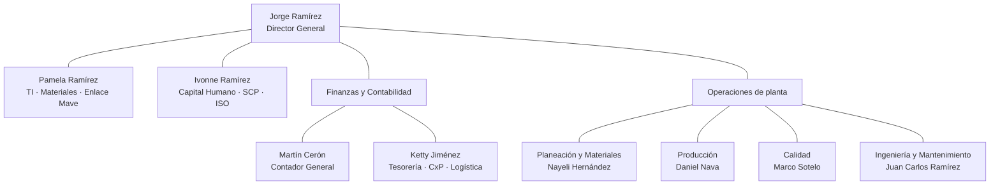
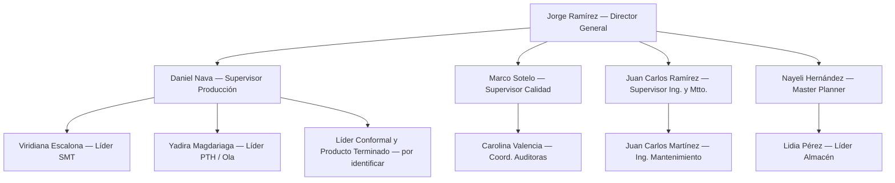

# Horacio — Organigrama General Mapartel

#mapartel #solucion-nexia #dato-digital

> [!note] Para qué sirve esta nota
> Mapa **funcional y general** de la organización para que Horacio sepa quién es quién, a qué área pertenece y a quién enrutar cada tema. No es el organigrama oficial de RH: las líneas de reporte formales están **por confirmar** (#revisar). Sin información sensible de diagnóstico — esta nota puede viajar en el prompt del bot.

## Estructura general

## Operaciones de piso y sus líderes

Tres líderes de operación. Los pizarrones HxH pertenecen a estas estaciones; **"Andromeda" es una tarjeta (NP 22SD72916-06), no una línea**.

| Proceso / Estación                             | Líder                                                   | Jefe directo     |
| ---------------------------------------------- | ------------------------------------------------------- | ---------------- |
| SMT (colocación/hornos) — líneas 411/481 y 520 | **Viridiana Escalona** ("Viri")                         | Daniel Nava      |
| PTH (inserción manual)                         | **Yadira Magdariaga**                                   | Daniel Nava      |
| Máquina de ola                                 | **Yadira Magdariaga**                                   | Daniel Nava      |
| Soldadura manual / retrabajo                   | **Yadira Magdariaga**                                   | Daniel Nava      |
| Inspección visual / Calidad                    | área de Calidad (Marco Sotelo / Carolina Valencia)      | —                |
| Pruebas ICT/FCT                                | **Yadira Magdariaga**                                   | Daniel Nava      |
| Conformal                                      | **Líder Conformal y Producto Terminado** — Rocio (Chio) | Daniel Nava      |
| Armado de arneses                              | Rocio (Chio)                                            | Daniel Nava      |
| Kitting / surtido almacén                      | **Lidia Pérez**                                         | Nayeli Hernández |
|                                                |                                                         |                  |

> Para el piloto Horacio: **Pamela Ramírez** define qué líneas/estaciones entran y confirma nombres el día uno. Avances de producción: las líderes entregan cajas a **Brenda Medina** (Embarques), quien captura contra OT en sistema.

## Estándares conocidos por estación/tarjeta

| Pizarrón / tarjeta | Estación | Estándar | Estatus |
|---|---|---|---|
| SMT 520 — tarjeta TJ000360 | SMT | **102 tarjetas/hr** | ✅ Oficial (FPR01.F) |
| CIL3 1V4 — tarjeta TJ000360 | PTH/manual-ola | ~75/hr hora completa, prorrateado por t. productivo; TJ000363 SMT: 108/hr según Estándar X Hora #revisar | ⚠️ Criterio de llenado no estándar |
| Tarjeta Andromeda (22SD72916-06) | PTH/manual-ola | Pizarrón usa 85–170/hr **sin estándar oficial** — origen por validar con Ingeniería | ❌ #dato-faltante |
| Máquina de ola — tarjeta Andromeda | Ola | Ciclo medido: 294 s/pasada (falta tarjetas/bastidor para pzs/hr) | #baseline |

> Regla de Horacio: si la estación/tarjeta no tiene estándar oficial, registra el real y marca "estándar por validar" — nunca inventa meta.

## Dueños de escalamiento — nombres completos y jefe directo

| Evento | Dueño (nombre completo) | Rol | Reporta a |
|---|---|---|---|
| Paro de línea | **Daniel Nava** | Supervisor de Producción y Manufactura | Jorge Ramírez (línea formal por confirmar #revisar) |
| Falta / material invertido | **Nayeli Hernández** (+ almacén: **Lidia Pérez**) | Master Planner / Líder de Almacén | Jorge Ramírez #revisar; Lidia opera bajo supervisión de Nayeli |
| Calidad | **Marco Sotelo** | Supervisor de Calidad | Jorge Ramírez #revisar |
| Falla de máquina | **Juan Carlos Martínez** ("JC") | Ingeniero de Mantenimiento (único técnico) | **Juan Carlos Ramírez** (Supervisor de Ingeniería y Mantenimiento) |
| Tema delicado | **Daniel Nava** + supervisor del área afectada | — | — |
| Resumen 17:00 | **Jorge Ramírez** | Director General | — |

## Jerarquía operativa (para la regla "tema delicado → avisar al supervisor")

> Líneas formales de reporte **no confirmadas por RH** (#revisar) — esta jerarquía es la operativa observada en gemba. Para Horacio basta: el "supervisor del área" de una líder de línea es **Daniel Nava**; el de almacén es **Nayeli Hernández**; el de auditoras es **Marco Sotelo**; el de mantenimiento es **Juan Carlos Ramírez**.

## Dirección y staff

| Persona | Rol | Notas para Horacio |
|---|---|---|
| Jorge Ramírez | Director General — Compras, Cotizaciones y Atención a Cliente | Recibe el **resumen del día 17:00**. Nunca recibe nombres de operadoras, solo líneas |
| Pamela Ramírez | Supervisora de TI — Gestión de Materiales, Precios y Cotizaciones, Enlace Mave | Cruza TI, Finanzas y Dirección; sesión diaria HPT de críticos |
| Ivonne Ramírez | Supervisora de Capital Humano (+ SCP, ISO 9001) | Dueña del **consentimiento de números de teléfono** del piloto |
| Maribel Beltrán | Responsable de Finanzas (externa) | Solo contexto; no es destino de escalamiento |

## Planeación y Materiales

| Persona | Rol | Temas que le enruta Horacio |
|---|---|---|
| Nayeli Hernández | Master Planner (programa de producción, materiales) | **Falta / material invertido** (junto con almacén) |
| Daniela Gómez | Compradora | Compras / seguimiento a OCs |
| Martha Gómez | Compradora | Compras / seguimiento a OCs |
| Lidia Pérez | Líder de Almacén (captura) | Surtido de kits, faltantes en almacén |
| Brenda Medina | Líder de Embarque | Embarques y entregas |

## Producción

| Persona | Rol | Temas que le enruta Horacio |
|---|---|---|
| Daniel Nava | Supervisor de Producción y Manufactura | **Paros (cualquier causa)** y temas delicados — primer destino del bot |
| Gabriela Hernández | Auxiliar de Producción y Manufactura | Apoyo a supervisión |
| Viridiana Escalona | Líder SMT | Reporta HxH de líneas SMT |
| Yadira Magdariaga | Líder PTH / Ensamble manual / Ola | Reporta HxH de PTH, soldeo, ola (incl. pizarrones CIL3, Andromeda #revisar) |
| Por identificar #revisar | Líder Conformal y Producto Terminado | Reporta HxH de conformal y empaque/PT |
| Ángel González | Análisis de Falla (Producción) | Fallas recurrentes de producto |

## Calidad

| Persona | Rol | Temas que le enruta Horacio |
|---|---|---|
| Marco Sotelo | Supervisor de Calidad (apoyo a producción) | **Paros / retenciones por calidad** |
| Carolina Valencia | Coordinadora de Auditoras de Calidad | Auditoras e inspección en línea |
| Jésica Jiménez | Ing. de Inspección de Recibo | Material rechazado en recibo |
| Víctor Gómez | Hombre Garantía | Reclamos post-venta |

## Ingeniería y Mantenimiento

| Persona | Rol | Temas que le enruta Horacio |
|---|---|---|
| Juan Carlos Ramírez | Supervisor de Ingeniería y Mantenimiento | Escalamiento si JC Martínez no acusa |
| Juan Carlos Martínez (JC) | Ingeniero de Mantenimiento (único técnico de planta) | **Fallas de máquina** — primer destino |
| Perla Guarneros | Ing. Desarrollo SW/HW | Desarrollo de producto/proceso |
| Darío Granadillo | Ing. Documentación Técnica y Proyectos | Documentación técnica |
| Gustavo Torres | Ingeniero de Materiales | Ingeniería de materiales |
| Juan Ramírez Morales | Ingeniería (rol por confirmar #revisar) | — |

## Capital Humano, Finanzas y soporte

| Persona | Rol |
|---|---|
| Guadalupe Ramírez | Generalista de Capital Humano |
| Juana Chávez | Analista Contable y Nóminas |
| Mara Peñaloza | Especialista en Salud, Seguridad e Higiene (SSH) |
| Martín Cerón | Contador General |
| Ketty Jiménez | Tesorería y CxP — Coordinación logística y compras |
| Alexander Cigala | Auxiliar de Contabilidad, Finanzas y TI |

## Regla de enrutamiento rápido (resumen para el prompt)

- Paro de línea → **Daniel Nava** · Falta/material → **Nayeli Hernández + Almacén (Lidia Pérez)** · Calidad → **Marco Sotelo** · Máquina → **Juan Carlos Martínez** (escala a Juan Carlos Ramírez) · Accidente/conflicto → **Daniel Nava + supervisor del área** (líneas→Daniel Nava, almacén→Nayeli Hernández, auditoras→Marco Sotelo, mtto→Juan Carlos Ramírez) · Resumen 17:00 → **Jorge Ramírez**
- Roles de soporte del piloto: **Pamela Ramírez** define líneas nuevas y líderes; **Ivonne Ramírez** (RH) gestiona el consentimiento de números de teléfono
- SLAs y cierre de loop: ver [[Horacio - Escalamiento y SLAs]]

## Links
- [[Horacio - System Prompt (SN-04 v2)]] · [[Horacio - Escalamiento y SLAs]] · [[Horacio - Catalogo Lineas y Estandares]]
- Evidencia de líneas/estándares: [[2026-06-09 - HxH Piso (SMT 520, CIL3, Andromeda) y Ciclo de Ola]]
- Fichas completas de cada persona en `02_Contactos/` (no van al bot)
